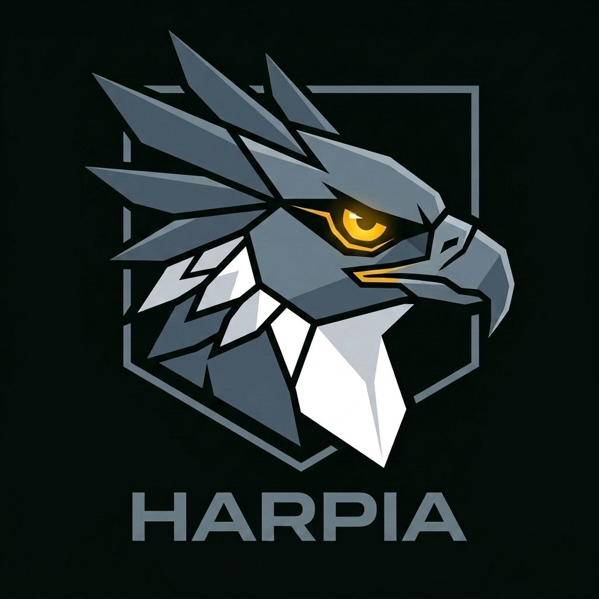

# 🦅 Harpia

<p align="center">
  
</p>

<p align="center">
  <strong>Linguagem de Programação Reativa, 100% Brasileira e Focada em Arquitetura Limpa</strong>
</p>

<p align="center">
  <a href="LICENSE"></a>
  <a href="docs/BRAND_GUIDELINES.md"></a>
  <a href="ROADMAP.md"></a>
</p>

---

## 📖 O que é a Harpia?

A **Harpia** é uma linguagem de programação brasileira moderna, focada em desenvolvimento ágil de ponta a ponta (Full Stack). Ela foi projetada para ir além do ensino de lógica de programação, permitindo a criação de sistemas profissionais de nível industrial — incluindo frontends SPA reativos, backends corporativos e APIs seguras — tudo utilizando a nossa língua nativa.

Representada pela imponente águia-real das Américas, a marca simboliza **soberania, precisão cirúrgica, força e foco absoluto**.

---

## 🚀 Instalação Rápida

Instale o compilador Harpia em segundos no seu sistema operacional executando o comando correspondente no terminal:

### Linux / macOS
```bash
curl -fsSL https://raw.githubusercontent.com/mat-dgruber/Harpia/main/Harpia/instalar.sh | bash
```

### Windows (PowerShell)
```powershell
irm https://raw.githubusercontent.com/mat-dgruber/Harpia/main/Harpia/instalar.ps1 | iex
```

---

## ⚡ Filosofia e Conceito: O Método Ponytail

A linguagem é orientada pela **Filosofia Ponytail** (preguiçosa com o código redundante, atenta com a leitura e pragmática com a solução):

1. **YAGNI (You Aren't Gonna Need It):** Eliminar qualquer código ou feature que não seja estritamente necessário.
2. **Modularização sem Cíclicos:** O compilador barra dependências cíclicas estaticamente antes da execução.
3. **Erros Didáticos e IA:** Mensagens estruturadas (`HRP-XXXX`) com dicas em português e suporte a explicações guiadas por IA local (`harpia erro explicar`).
4. **Legibilidade Semântica:** Uso do operador de canais (`|>`) e termos nativos do ecossistema brasileiro (como `raiz`, `ninho`, `copa` e `correnteza` para as bibliotecas padrão).

---

## 🏗️ Clean Architecture e DDD Nativo

A Harpia foi desenhada sob a premissa de estruturar projetos robustos por padrão. Ao iniciar novos projetos corporativos, o compilador gera a árvore organizacional baseada em **DDD (Domain-Driven Design)** e **Clean Architecture**:

```text
meu-app/
├── dependencias.json        -> Manifesto de dependências e configurações
├── main.hrp                 -> Ponto de entrada (Bootstrapper)
├── dominio/                 -> Regras de Negócio Isoladas
│   ├── modelos/             -> Entidades e Objetos de Valor (ex: usuario.hrp)
│   └── servicos/            -> Validações e regras de domínio (ex: validador.hrp)
├── infra/                   -> Detalhes de Tecnologia (Banco de Dados, APIs)
│   ├── bd/                  -> Conexões e repositórios (ex: sqlite.hrp)
│   └── api/                 -> Clientes de requisição externa
├── web/                     -> Camada de Apresentação (Frontend SPA)
│   ├── rotas/               -> Páginas com File-system Routing (ex: index.hrp)
│   ├── componentes/         -> Componentes UI reutilizáveis (ex: botao.hrp)
│   └── estilos/             -> Folhas de estilo locais ou globais
└── testes/                  -> Camada de Testes Automatizados
```

---

## ✨ Características Principais & Performance

- **Direct-Threaded JIT VM:** Bytecodes dinamicamente traduzidos em chamadas Go nativas em tempo de execução, otimizando o loop de decodificação.
- **Pool de Alocação Eden:** Pré-boxeamento de inteiros curtos (de `-100` a `2000`) em $O(1)$ para aniquilar pressões desnecessárias do Garbage Collector.
- **Reatividade Nativa (SPA):** Transpilação reativa eficiente para a web (`--alvo=web`) baseada em Sinais (`var [contador, definirContador] = sinal(0)`), Efeitos e Estado Global.
- **Estilização Nativa:** Blocos de estilo CSS integrados nativamente e classes utilitárias na estrutura de marcação.
- **Contrato RPC Automático:** Comunicação simplificada entre o Front-end e o Back-end sem a necessidade de APIs manuais complexas.

---

## 🛠️ Caixa de Ferramentas (CLI)

A ferramenta de linha de comando (`harpia`) oferece utilitários robustos de ponta a ponta para gerenciar, compilar, testar e estruturar seus projetos. Abaixo estão os comandos disponíveis com suas especificações e flags:

### 1. `harpia executar` (ou `harpia exec`)

Executa um script físico Harpia ou inicia o console de desenvolvimento interativo (REPL).

- **Uso:** `harpia executar [caminho-do-arquivo.hrp] [flags]`
- **Flags Principais:**
  - `-c, --codigo`: Executa um trecho de código diretamente no terminal (ex: `harpia executar -c "imprimir('Olá!')"`).
  - `--estrito`: Ativa a validação estrita de anotações de tipo em tempo de execução.
- **Necessidades:** Sem argumentos, inicia o REPL com ajuda e inspetor de memória embutidos; com argumento, executa o arquivo `.hrp` imediatamente.

### 2. `harpia checar`

Linter semântico offline-friendly que realiza análise estática de sintaxe e semântica no arquivo especificado sem executá-lo.

- **Uso:** `harpia checar [caminho-do-arquivo.hrp]`
- **Saída:** Diagnósticos detalhados de variáveis não declaradas, reatribuição de constantes, assinaturas de funções incorretas ou erros de sintaxe.

### 3. `harpia compilar`

Transpila o seu código fonte Harpia para outras plataformas (como a Web com suporte a Virtual DOM e JavaScript, ou executáveis nativos via AOT).

- **Uso:** `harpia compilar --alvo=web --entrada=main.hrp --saida=dist`
- **Flags Principais:**
  - `-a, --alvo`: Alvo da compilação. Opções: `web` (padrão), `nativo`, `wasm`.
  - `-e, --entrada`: Ponto de entrada/arquivo principal do projeto (ex: `main.hrp`).
  - `-s, --saida`: Pasta destino onde serão gravados os arquivos transpilados/compilados (padrão: `dist`).

### 4. `harpia servir`

Inicia um servidor web local extremamente leve e rápido para hospedar os arquivos compilados da sua aplicação SPA reativa e visualizá-la no navegador.

- **Uso:** `harpia servir --diretorio=dist --porta=8080`
- **Flags Principais:**
  - `-d, --diretorio`: Pasta que contém os arquivos que serão servidos (padrão: `dist`).
  - `-p, --porta`: Porta na qual o servidor web será escutado (padrão: `8080`).

### 5. `harpia novo` (ou `iniciar`, `inicializar`)

Inicializa uma nova estrutura de projeto baseada em Clean Architecture e DDD com termos em português.

- **Uso:** `harpia novo [backend | frontend | monolito] [nome-do-projeto]`
- **Subcomandos:**
  - `backend`: Cria uma estrutura enxuta de backend focada em APIs lógicas, conectores de banco de dados e concorrência leve.
  - `frontend`: Cria uma estrutura reativa cliente puramente SPA de alto desempenho baseada em Sinais e Virtual DOM.
  - `monolito`: Cria um novo monolito completo de Frontend + Backend com pastas explicativas e documentação interna de arquitetura.

### 6. `harpia crie`

Assistente de geração dinâmica de novos arquivos de templates seguindo a Clean Architecture dentro de um projeto existente.

- **Uso:** `harpia crie [rota | componente | modelo] [nome]`
- **Subcomandos:**
  - `rota`: Cria um novo arquivo de rota SPA (`.hrp`) na pasta correspondente.
  - `componente`: Cria um componente de interface (`.hrp`) e seu respectivo arquivo de estilos dinâmicos (`.estilo.hrp`).
  - `modelo`: Cria um novo modelo/entidade de dados rico e tipado na camada de domínio.

### 7. `harpia testar`

Varre e isola testes unitários lógicos declarados na cláusula sintática `testar "nome" { ... }` nativa da linguagem, fornecendo um relatório consolidado de acertos e falhas.

- **Uso:** `harpia testar [caminho_ou_pasta]`

### 8. `harpia lsp`

Inicia o servidor oficial LSP (Language Server Protocol) do Harpia via stdio, oferecendo suporte nativo para editores de código (como o VS Code) com autocomplete, hover lendo comentários de três barras (`///`), linter de arquitetura limpa e formatação automática de código ao salvar.

- **Uso:** `harpia lsp`

---

## 📚 Documentação & Guias

Para mais informações sobre as regras de desenvolvimento do projeto:

- 🎨 **[Diretrizes de Marca & Identidade Visual](docs/BRAND_GUIDELINES.md)**
- 💡 **[Exemplos Práticos de Aplicação e Código](docs/harpia-brand-examples.md)**
- 🚀 **[Guia de Contribuição](CONTRIBUTING.md)**
- 🗺️ **[Roadmap de Evolução](ROADMAP.md)**

---

<p align="center">
  
</p>

<p align="center">
  Feito com ❤️ pela Comunidade Brasileira de Programação 🇧🇷
</p>
