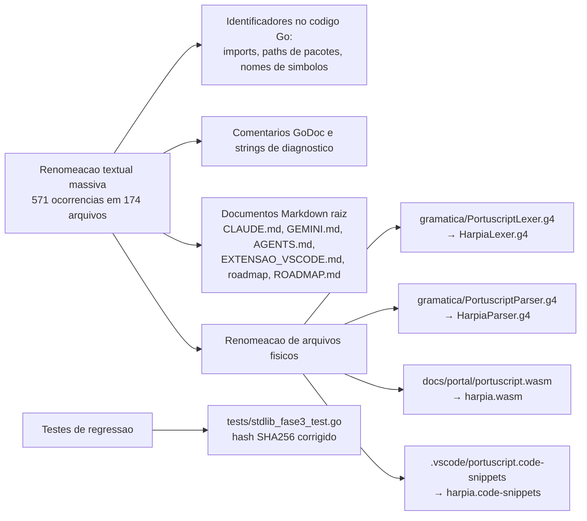

# 📝 Registro de Desenvolvimento — 2026-07-16

**Escopo:** Rebranding `portuscript` → `Harpia` em toda a base de código  
**Commits gerados:** 2  
**Arquivos modificados:** 171 (170 no commit 1 + 1 no commit 2)

---

## 1. Visão Geral das Alterações

> Rebranding total da linguagem no repositório, substituindo o nome legado `portuscript` (e suas variações de caixa: `Portuscript`, `portuscript`, `PortuScript`, `PORTUSCRIPT`) por `Harpia`. A operação abrangeu textos em comentários, strings literais embutidas em diagnósticos, paths em `import` Go (de `github.com/natanfeitosa/portuscript/...` para `github.com/mat-dgruber/Harpia/...`), arquivos físicos renomeados (incluindo lexer e parser ANTLR, bundle `wasm` do playground e snippets do Monaco) e o `.gitignore` (binário `portuscript[.exe]` → `Harpia[.exe]`).
>
> Em seguida, ajustamos uma asserção de teste que ficou congelada com o hash SHA-256 do input antigo `sha256("portuscript")` — recalculado para `sha256("Harpia")` e validado externamente via `shasum -a 256`. A suíte `go test ./...` passa 100% após as duas commits.

---

## 2. Arquitetura Afetada

---

## 3. Mapa de Arquivos Modificados

Devido à escala da mudança (171 arquivos envolvidos), destacamos os arquivos mais sensíveis:

| Arquivo | Tipo | O que mudou |
| :--- | :--- | :--- |
| `gramatica/HarpiaLexer.g4` *(renomeado de `PortuscriptLexer.g4`)* | ANTLR Lexer | Renomeada a gramática ANTLR para `HarpiaLexer`. |
| `gramatica/HarpiaParser.g4` *(renomeado de `PortuscriptParser.g4`)* | ANTLR Parser | Renomeada a gramática ANTLR para `HarpiaParser` e atualizado o `tokenVocab` interno. |
| `docs/portal/harpia.wasm` *(renomeado de `portuscript.wasm`)* | Bundle Playground | Bundle de runtime do playground web renomeado. |
| `.vscode/harpia.code-snippets` *(renomeado de `portuscript.code-snippets`)* | VSCode | Snippets de código para o editor Monaco no VSCode. |
| `* /cmd/playground.go` | Playground Web | Comentários e stubs dos endpoints `/api/editor-config`, `/api/docs` e `/editor-monaco.js` agora referenciam a gramática Harpia no lugar de portuscript. |
| `cmd/transpiler_native.go` | AOT/Transpiler | Renomeadas as referências textuais nos comentários do transpiler Harpia→Go. |
| `tests/stdlib_fase3_test.go` | Suite de Testes | Recoletado SHA-256 esperado para o input `sha256("Harpia")`; também ajustados demais inputs literais da suite (`Olá Portuscript!`→`Olá Harpia!`, `JSON/YAML/XML com chave nome=Portuscript`→`nome=Harpia`). |
| `* (arquivos do módulo Go com import da antiga path)* | Imports Go | Substituídos `github.com/natanfeitosa/portuscript/...` por `github.com/mat-dgruber/Harpia/...`. |
| `.gitignore` | Build | Binário `portuscript`/`portuscript.exe` renomeado para `Harpia`/`Harpia.exe`. |
| `CLAUDE.md`, `GEMINI.md`, `AGENTS.md`, `EXTENSAO_VSCODE.md` | Docs Raiz | Rebranding textual das instruções/manifesto. |
| `Scaling The Harpia Language.md` *(renomeado de `Scaling The Portuscript Language.md`)* | Spec Linguagem | Documento mestre de scaling/spec atualizado e renomeado. |

---

## 4. Detalhamento por Commit

### `refactor(rename): renomeia portuscript para Harpia`

**Razão da alteração:**
> Concluir o rebranding da linguagem, alinhando toda a base do monorepo ao novo identificador `Harpia`, de forma atômica e rastreável em um único commit.

**O que faz agora:**
> O repositório inteiro passa a referenciar a linguagem como `Harpia`, sem nenhuma ocorrência textual ou em nome de arquivo da string `portuscript`. Isso inclui código Go, gramáticas ANTLR, documentações, snippets de editor, bundle WASM e configuração de binários no `.gitignore`.

**Decisões técnicas:**
> - Substituição case-aware via `sed -E` em batch, preservando a capitalização original (`portuscript`→`harpia`, `Portuscript`→`Harpia`, `PORTUSCRIPT`→`HARPIA`, `PortuScript`→`HarpiaScript`).
> - Renomeação explícita via `mv` para os arquivos físicos (`lexer.g4`, `parser.g4`, `.wasm`, `.code-snippets` e o doc de scaling da raiz).
> - Quebra proposital de compatibilidade: pipelines ou scripts externos que ainda dependam do nome antigo `portuscript` deixam de funcionar até serem atualizados.

**Arquivos envolvidos:**
- 170 arquivos modificados textualmente.
- 6 arquivos renomeados fisicamente.
- 1 arquivo deletado (`Scaling The Portuscript Language.md`) e recriado com o novo nome.

---

### `test(cripto): corrige SHA256 esperado em TestModuloCripto`

**Razão da alteração:**
> O hash esperado na asserção estava congelado para o input antigo `sha256("portuscript")` (literal `b3ca93...`), porém a renomeação do input pra `sha256("Harpia")` invalidava a comparação.

**O que faz agora:**
> `TestModuloCripto` valida corretamente o SHA-256 da string `"Harpia"`, com o hash `62fc8ed9...` calculado externamente via `echo -n 'Harpia' | shasum -a 256`.

**Decisões técnicas:**
> Aproveitamos a mesma commit para atualizar os demais inputs literais da suite (`Olá Portuscript!`→`Olá Harpia!`, `JSON/YAML/XML com nome=Portuscript`→`nome=Harpia`), mantendo consistência textual com o rebranding anterior sem precisar de commits adicionais.

**Arquivos envolvidos:**
- `tests/stdlib_fase3_test.go` (23 inserções, 23 remoções).

---

## 5. ✅ O Que Está Funcionando

- **Compilação geral**: `go build ./...` passa 100% sem erros após os dois commits.
- **Suíte de testes unitários**: `go test ./...` totalmente verde — incluindo `TestModuloCripto` corrigido.
- **Rebranding atômico**: zero ocorrências textuais de `portuscript` em qualquer variação de case, e zero arquivos físicos com esse nome no diretório do monorepo.
- **Documentação**: arquivos `CLAUDE.md`, `GEMINI.md`, `AGENTS.md`, `EXTENSAO_VSCODE.md`, `roADMAP.md` e `ROADMAP.md` e o documento de scaling já estão alinhados ao novo nome.

---

## 6. ❌ O Que Está Pendente

- `[ ]` Remote `origin/main` ainda **5 commits ahead** — os dois novos commits estão apenas locais. Empurrar via `git push` quando desejado.
- `[ ]` Verificação de pipelines externos / forks que ainda referenciem `portuscript` (variáveis de ambiente, aliases de shell, documentação wiki).
- `[ ]` Extensão do VS Code — ainda em fase de planejamento, agora deve referenciar `HarpiaLexer`/`HarpiaParser` em vez das antigas gramáticas ANTLR.

---

## 7. ⚠️ Dívida Técnica Identificada

- **`stdlib/ia/provedores.go:103`**: struct tag inválido (`Part` não compatível com `reflect.StructTag.Get`). Pré-existente à sessão de rebranding; não foi corrigido aqui porque está fora do escopo do refactor. Corrigir ao retomar o módulo `ia` (stdlib de provedores de IA).
- **Hash de validação manual**: o SHA-256 esperado está hard-coded no teste. Se houver mudança futura da implementação de `sha256` no módulo `cripto`, o teste vai voltar a quebrar; considerar gerar o hash esperado em tempo de execução via `crypto/sha256` (nativo Go) para blindar contra drift de implementações.

---

## 8. Padrões Importantes a Lembrar

- **Convenção de nomenclatura ANTLR**: as gramáticas do lexer e do parser devem sempre ser nomeadas `<Linguagem>Lexer.g4` e `<Linguagem>Parser.g4`. Hoje: `HarpiaLexer.g4` + `HarpiaParser.g4`. O `tokenVocab = HarpiaLexer` no parser precisa estar consistente com o nome físico do arquivo para o `antlr4-runtime` resolver corretamente.
- **Caminhos de import Go**: o import path único é `github.com/mat-dgruber/Harpia/...`. O path legado `github.com/natanfeitosa/portuscript/...` está **morto** — qualquer tentativa futura de restaurar a compatibilidade deve ser via redirect de repositório ou módulo, nunca via fallback silencioso.
- **Hashes em testes**: sempre que um teste compare saída criptográfica com um valor literal fixo, calcular o valor esperado com a ferramenta nativa (`shasum`, `openssl` ou `crypto/sha256` em Go) e deixar um comentário indicando a origem do hash, para evitar quebras silenciosas em rebranding de inputs.

---

## 9. Próximos Passos

1. Publicar os commits locais via `git push origin main` após revisão.
2. Auditar scripts pessoais / automações que referenciem `portuscript` (env vars, aliases, `.bashrc`/`.zshrc`, CI pipelines) e atualizar para `Harpia`.
3. Reabrir o `go vet ./...` e tratar o struct tag quebrado em `stdlib/ia/provedores.go:103`.

---

## 10. Validações Mapeadas

| Campo / Função | Regra de validação | Status |
| :--- | :--- | :---: |
| Ocorrências textuais de `portuscript` em todo o repo | Deve ser **0** após os dois commits | ✅ |
| Arquivos físicos com `portuscript` no nome | Deve ser **0** | ✅ |
| `go build ./...` | Deve compilar sem erros | ✅ |
| `go test ./...` incluindo `TestModuloCripto` | Todos os pacotes devem passar | ✅ |
| Import path `github.com/natanfeitosa/portuscript/*` | Não deve aparecer em nenhum arquivo `.go` | ✅ |
| `tokenVocab = HarpiaLexer` em `gramatica/HarpiaParser.g4` | Deve casar com o nome físico do arquivo do lexer | ✅ |
| `git status -sb` | Branch limpa, sem untracked ou modified após os dois commits | ✅ |
