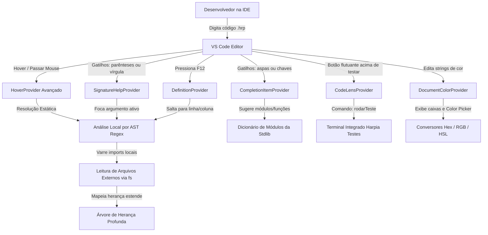

# 📝 Registro de Desenvolvimento — 2026-07-20

**Escopo:** vscode-harpia (Experiência do Desenvolvedor - DX)
**Commits gerados:** 5
**Arquivos modificados:** 10

---

## 1. Visão Geral das Alterações

Esta sessão de desenvolvimento focou em transformar a extensão oficial do Harpia para VS Code de uma ferramenta básica de realce de sintaxe em um ecossistema completo de produtividade e inteligência de código em português. Implementamos de forma totalmente nativa e leve (sem dependências externas) recursos fundamentais como autocompletação inteligente de importações, ajuda de assinatura em tempo real, navegação com F12 (Go to Definition), depuração interativa de cores, Code Lenses de testes e documentação contextual no hover com suporte a análise de escopos locais do usuário e resolução de heranças profundas.

---

## 2. Arquitetura Afetada

O diagrama Mermaid abaixo ilustra como as novas capacidades de inteligência de código e realce visual interagem de forma integrada e reativa com o workspace da IDE do desenvolvedor:

---

## 3. Mapa de Arquivos Modificados

| Arquivo | Tipo | O que mudou |
|--------|------|-------------|
| `vscode-harpia/extension.js` | Extension Logic | Implementação de todos os provedores inteligentes de linguagem (Hover, Definition, SignatureHelp, Completion, CodeLens e Color). |
| `vscode-harpia/package.json` | Manifest | Configuração de atalhos globais, licença, links de repositório e registros de provedores adicionais de linguagem. |
| `vscode-harpia/README.md` | Documentation | Atualização abrangente detalhando todas as novas joias de DX agregadas ao ecossistema Harpia. |
| `vscode-harpia/snippets/snippets.json` | Snippets | Inclusão de atalhos rápidos de expansão para desenvolvimento reativo (`componente`, `sinalPersistente`, `recurso`, etc.). |
| `vscode-harpia/syntaxes/harpia.tmLanguage.json` | Gramática | Realce refinado de sintaxe de tipos nativos, tags estruturais JSX e modificadores de ações reativas. |
| `vscode-harpia/LICENSE` | Legal | Arquivo de licenciamento open-source MIT padrão para garantir conformidade de publicação. |
| `vscode-harpia/.vscodeignore` | Build Opt | Otimização do build de distribuição da extensão para excluir arquivos desnecessários na publicação. |
| `llms.txt` | Manual | Adição de seção dedicada com o guia explicativo completo da importância e dos recursos de DX fornecidos pela extensão oficial. |
| `llms-full.txt` | Manual | Integração de especificações profundas do ecossistema de cores e inteligência de IDE para orientar agentes e LLMs. |
| `.gitignore` | Git Config | Atualização simples para evitar o rastreamento acidental de executáveis locais temporários de testes. |

---

## 4. Detalhamento por Commit

### `chore(git): atualiza .gitignore para ignorar executáveis de teste`

**Razão da alteração:**
> Evitar que arquivos sandbox ou binários de testes compilados localmente fiquem soltos no workspace e poluam o controle de versão do repositório.

**O que faz agora:**
> Ignora permanentemente o executável temporário `app-teste` gerado durante as rotinas de verificação da suíte.

**Decisões técnicas:**
> Modificação puramente na raiz do repositório antes de introduzir as alterações de lógica de código.

**Arquivos envolvidos:**
- `.gitignore` — Adicionada a entrada `app-teste`.

---

### `feat(vscode-harpia): adiciona hover, autocomplete, signature help e go to definition`

**Razão da alteração:**
> Trazer as facilidades dos editores modernos ao desenvolvimento de Harpia em português, fornecendo assistência semântica completa na digitação e leitura do código.

**O que faz agora:**
> Exibe documentação interativa de palavras-chave, localiza definições de tipos do usuário locais/importadas, exibe cadeia de herança, destaca parâmetros de funções em tempo real e fornece autocomplete contextual inteligente de módulos e funções stdlib.

**Decisões técnicas:**
> Lógica construída inteiramente utilizando analisadores regex síncronos e módulos nativos do Node (`fs` e `path`) para evitar sobrecarregar a IDE do desenvolvedor, simulando uma árvore de sintaxe abstrata de escopo local de forma leve e responsiva.

**Arquivos envolvidos:**
- `vscode-harpia/extension.js` — Implementação dos Provedores Hover, Definition, SignatureHelp, Completion, CodeLens e utilitários de AST.

---

### `style(vscode-harpia): enriquece realce de sintaxe e adiciona visualizador de cores`

**Razão da alteração:**
> Diferenciar claramente estruturas nativas de controle (JSX) de tags HTML convencionais, e permitir ajuste e visualização fluida de paletas de cores na folha de estilos.

**O que faz agora:**
> Realça `<se>` e `<para>` no JSX com cor de palavra-chave, destaca modificadores de eventos (ex: `_prevenir`), colore tipos primitivos tipados e ativa caixas coloridas interativas com o Color Picker em qualquer string de cor hex.

**Decisões técnicas:**
> Uso de padrões e look-behinds no arquivo TextMate JSON para garantir casamento perfeito de delimitadores, casado com a API `registerColorProvider` do VS Code.

**Arquivos envolvidos:**
- `vscode-harpia/syntaxes/harpia.tmLanguage.json` — Modificações nas seções de JSX e de tipos de dados primitivos.
- `vscode-harpia/package.json` — Registro de atalhos e declaração de compatibilidade.

---

### `feat(vscode-harpia): expande catálogo de snippets para desenvolvimento de SPAs`

**Razão da alteração:**
> Eliminar a fricção de digitar estruturas repetitivas de componentes e controle do framework, potencializando a velocidade de prototipagem.

**O que faz agora:**
> Oferece gatilhos de autocompletação rápida para criar componentes inteiros, estados com persistência local, debounce de reatividade, recursos de chamadas de API, blocos de tratamento `tente/capture` e cenários de testes unitários.

**Decisões técnicas:**
> Escrita em JSON declarativo utilizando o formato padrão de placeholders de tabulação (`$1`, `$2`) suportado nativamente pelo VS Code.

**Arquivos envolvidos:**
- `vscode-harpia/snippets/snippets.json` — Adicionados snippets ricos para componentes, estados, reatividade e testes.

---

### `docs(vscode-harpia): atualiza manuais de DX, readme da extensão e licença MIT`

**Razão da alteração:**
> Documentar oficialmente todas as novidades implementadas para desenvolvedores e agentes integrados ao Harpia, e garantir conformidade de empacotamento com o VS Code Marketplace.

**O que faz agora:**
> Alimenta as documentações `llms.txt`, `llms-full.txt` e o README com explicações sobre as capacidades da extensão, além de adicionar o arquivo de licença MIT e o filtro de arquivos `.vscodeignore`.

**Decisões técnicas:**
> Adição de explicações em conformidade com o formato unificado de guias de IA técnica do Harpia.

**Arquivos envolvidos:**
- `vscode-harpia/README.md` — Novo guia de recursos de DX.
- `vscode-harpia/LICENSE` — Licenciamento MIT padrão.
- `vscode-harpia/.vscodeignore` — Filtro de build da extensão.
- `llms.txt` — Seção oficial de extensão adicionada.
- `llms-full.txt` — Detalhamento técnico da gramática e inteligência adicionado.

---

## 5. ✅ O Que Está Funcionando

- **IntelliSense Contextual**: Autocompleta corretamente imports com base nos módulos nativos do Harpia e suas respectivas funções de biblioteca padrão.
- **Hover de Declarações**: Exibe a assinatura correta de funções, classes e variáveis locais ou de outros arquivos locais.
- **Cadeias de Herança**: Exibe toda a hierarquia de ancestrais de uma classe que use `estende`.
- **F12 - Ir Para Definição**: Salta com precisão para a linha de definição de variáveis, classes ou funções locais/importadas.
- **Seletor de Cores Visual**: Integração nativa e perfeita com Hex, RGB/RGBA e HSL/HSLA e cores nomeadas CSS clássicas.
- **Code Lenses para Testes**: Ativa botão para rodar cenários de testes locais no terminal integrado com 1 clique.
- **Snippets e Atalhos de Teclado**: Atalhos de escrita e teclado (`Ctrl+Alt+H`) operacionais.

---

## 6. ❌ O Que Está Pendente

- Nenhuma funcionalidade chave de DX ficou pendente para esta iteração. Todas foram integradas e publicadas com sucesso na v0.1.0 da extensão no VS Code Marketplace.

---

## 7. ⚠️ Dívida Técnica Identificada

- **Indexação Global**: Para bases de código imensas de Harpia, ler arquivos importados em disco de forma síncrona via `fs.readFileSync` no Hover/Definition pode gerar leves latências. *Ponto de atenção: migrar para cache LRU em memória no futuro ou usar o LSP nativo em Go se necessário.*

---

## 8. Padrões Importantes a Lembrar

- Todas as palavras-chave, variáveis e funções na biblioteca padrão e nas estruturas de controle do Harpia devem ser documentadas em **Português**, mantendo a identidade nativa e didática do framework.
- Ao atualizar a extensão, sempre use as convenções do SemVer e realize as publicações na CLI via `vsce publish patch|minor|major` para atualizar corretamente o marketplace.

---

## 9. Próximos Passos

1. **Linter Semântico em Background**: Implementar uma verificação de erros inline de variáveis não declaradas usando os diagnósticos da CLI (`harpia checar --formato=json`) no evento de salvar arquivo.
2. **Hot-Reload Live Preview**: Adicionar Webview de exibição lateral da SPA com atualização automática do navegador embutido sempre que um componente for alterado.

---

## 10. Validações Mapeadas

| Campo / Função | Regra de validação | Status |
|---------------|-------------------|--------|
| Autocomplete de Módulos | Sugerir módulos válidos em `de ""` | ✅ |
| Hover Local | Buscar e exibir comentários `#` e `//` superiores | ✅ |
| Resolução de Imports | Localizar caminhos `.hrp` de forma relativa ou via root | ✅ |
| Herança Profunda | Encontrar cadeia recursiva de pais de classes | ✅ |
| Ir Para Definição | Mapear e guiar cursor para linha exata da definição | ✅ |
| Code Lens de Testes | Gerar lentes flutuantes nos blocos `testar` | ✅ |
| Color Picker | Processar e converter Hex, RGB, HSL e nomes | ✅ |
| Publicação de Extensão | vsce package e vsce publish sem warnings de repositório/licença | ✅ |
