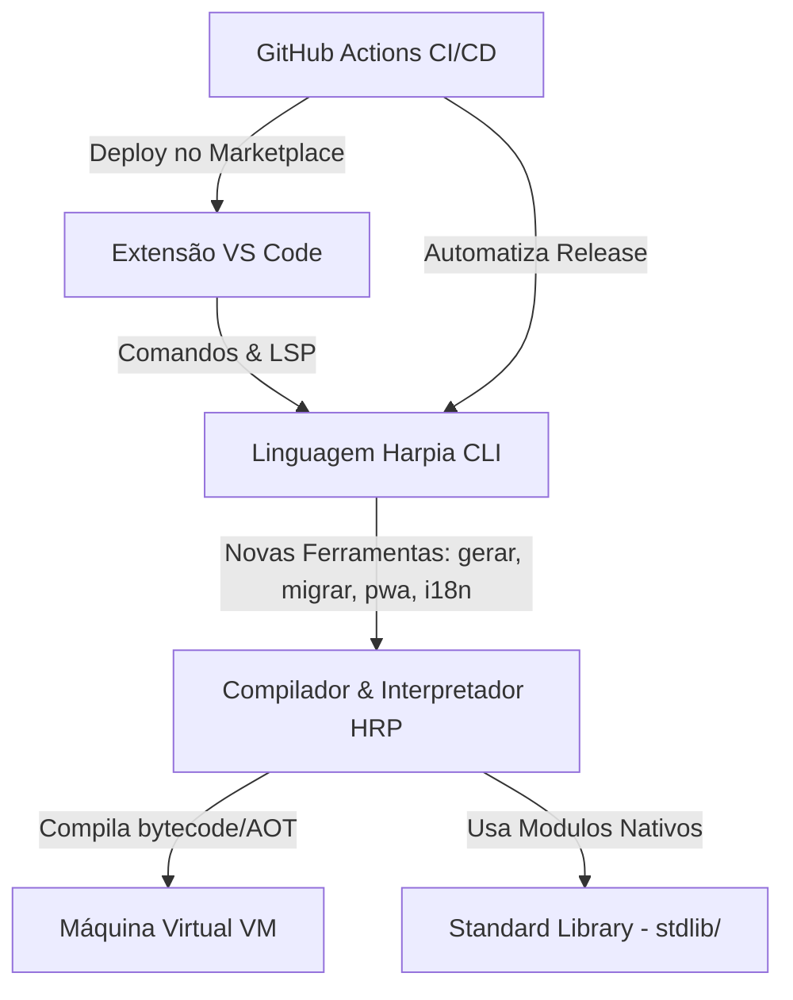

# 📝 Registro de Desenvolvimento — 2026-07-20

**Escopo:** Reestruturação do Ecossistema da Linguagem Harpia & Automações de CI/CD
**Commits gerados:** 6
**Arquivos modificados:** 227 (entre alterados, deletados e novos)

---

## 1. Visão Geral das Alterações

> Reestruturação e limpeza completa do motor interno da linguagem Harpia, removendo módulos obsoletos (`ptst`) e substituindo-os pelo novo compilador unificado (`hrp`). A CLI oficial foi aprimorada com novas capacidades de scaffolding e geração de projetos, com sincronização paralela das bibliotecas padrão e testes. Adicionalmente, a infraestrutura de deploy contínuo (CI/CD) foi implementada para automatizar o release síncrono do compilador e da extensão VS Code no Marketplace oficial.

---

## 2. Arquitetura Afetada

Abaixo está a representação conceitual de como o compilador, a biblioteca padrão, a máquina virtual e as ferramentas de infra/IDE interagem no ecossistema atualizado:

---

## 3. Mapa de Áreas de Arquivos Modificados

| Diretório / Área | Tipo            | O que mudou                                                                                                         |
| ---------------- | --------------- | ------------------------------------------------------------------------------------------------------------------- |
| `ptst/`          | Motor Antigo    | Removido por completo devido à substituição definitiva pelo `hrp/`.                                                 |
| `cmd/`           | Interface CLI   | Adicionados comandos de scaffolding (`gerar.go`, `migrar.go`, `pwa.go`, `i18n.go`) e aprimoramento de formatadores. |
| `stdlib/`        | Core Libs       | Ajuste em módulos nativos de banco de dados, ia, ffi, resiliência, e telemetria.                                    |
| `vm/`            | Máquina Virtual | Atualização do bytecode, interpretador de opcodes e estabilidade do runtime.                                        |
| `hrp/`           | Compilador Core | Registro e ativação oficial do novo compilador de código Harpia.                                                    |
| `vscode-harpia/` | Extensão IDE    | Atualizações de dependências (`package.json`) e fluxos de publicação documentados.                                  |
| `.github/`       | Infraestrutura  | Criação do pipeline de release integrada.                                                                           |

---

## 4. Detalhamento por Commit

### `refactor(ptst): remove motor de execucao ptst antigo`

- **Razão da alteração:** O motor `ptst` estava obsoleto e foi integralmente substituído pelo compilador estruturado `hrp/`.
- **O que faz agora:** Árvore de trabalho limpa de códigos antigos e legados.
- **Decisões técnicas:** Deleção completa de 50 arquivos para simplificar a manutenção do monorepo.

### `feat(cmd): atualiza comandos cli e adiciona novos geradores`

- **Razão da alteração:** Facilitar a inicialização de projetos Harpia modernos e PWA.
- **O que faz agora:** Oferece ferramentas prontas para gerar rotas, criar PWAs, sincronizar i18n e migrações.
- **Arquivos envolvidos:** `cmd/gerar.go`, `cmd/i18n.go`, `cmd/migrar.go`, `cmd/pwa.go`, etc.

### `feat(stdlib): atualiza biblioteca padrao e testes correspondentes`

- **Razão da alteração:** Suporte estendido para reatividade em tempo real e novos provedores de Inteligência Artificial.
- **O que faz agora:** Testes integrados e unitários ajustados para banco de dados e telemetria.
- **Arquivos envolvidos:** `stdlib/` (vários subdiretórios) e `tests/`.

### `refactor(vm): atualiza maquina virtual, compilador e core`

- **Razão da alteração:** Alinhamento da máquina virtual com os novos opcodes e transpilador web.
- **O que faz agora:** Execução otimizada de bytecodes Harpia de forma mais veloz.
- **Arquivos envolvidos:** `vm/compilador.go`, `vm/opcodes.go`, `vm/vm.go`, `hrp/`.

### `docs(relevantes): atualiza documentacao, metas, exemplos e remove temporarios`

- **Razão da alteração:** Manter a especificação e metas da linguagem 100% atualizadas e remover logs e relatórios temporários de IA locais.
- **O que faz agora:** README, Manual e Roadmap sincronizados com o estado v1.0.0-rc1.

### `chore(vscode): atualiza dependencias e configuracoes da extensao`

- **Razão da alteração:** Preparação para envio público ao Marketplace oficial da Microsoft.
- **O que faz agora:** Configurações atualizadas para garantir a consistência das extensões locais.

### `ci: adiciona fluxo de deploy integrado via github actions`

- **Razão da alteração:** Necessidade de automação de releases síncronas.
- **O que faz agora:** Realiza deploy automático do compilador e extensão ao enviar uma tag `v*`.

---

## 5. ✅ O Que Está Funcionando

- Compilação nativa e para WebAssembly (AOT) via CLI.
- Novo compilador `hrp` ativo e integrado.
- Mecanismo de publicação oficial e local via `vsce`.
- Pipeline de CI/CD para deploy multiplataforma via GitHub Actions.

---

## 6. ❌ O Que Está Pendente

- `[ ]` Correção do linter interno no exemplo de formulário frontend (`exemplos/frontend/formulario/main.hrp`) — _erros de declaração duplicada e identificador 'tamanho' não mapeado pelo validador local de variáveis._

---

## 7. ⚠️ Dívida Técnica Identificada

- **Linter de Exemplos:** Correções no validador sintático de arquivos `.hrp` para ignorar erros de funções nativas globais como `tamanho()`.
- **Refatorações de Testes:** Unificação de stubs de testes de infraestrutura no diretório `tests/`.

---

## 8. Padrões Importantes a Lembrar

- Sempre sincronizar a tag de versão do compilador (Go) com a versão da extensão do VS Code (`package.json`) ao lançar versões estáveis. O workflow de CI/CD automatiza isso caso seja criada uma tag `v*`.

---

## 9. Próximos Passos

1. Registrar o segredo `VSCE_PAT` no repositório GitHub para ativar o deploy automático da extensão.
2. Criar a primeira tag de release candidate `git tag v1.0.0-rc1`.
3. Validar a execução completa do pipeline do GitHub Actions para a primeira release oficial da linguagem Harpia.
