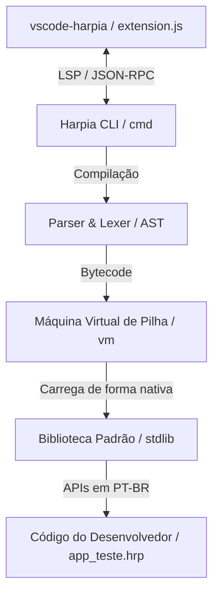

# 📝 Registro de Desenvolvimento — 2026-07-22

**Escopo:** Documentação e Comentários do Compilador Harpia, Extensão VS Code, CLI e Stdlib
**Commits gerados:** 6
**Arquivos modificados:** 83

---

## 1. Visão Geral das Alterações
Nesta sessão de desenvolvimento, foi realizada uma ampla cobertura de documentação e comentários inline nos padrões idiomáticos Godoc (para arquivos Go) e JSDoc (para a extensão do VS Code escrita em JavaScript), bem como atualizações nos manuais de referência globais e especificações para modelos de linguagem. Nenhum comportamento funcional ou lógico do compilador ou extensão foi alterado, preservando 100% da integridade da base de código do Harpia e garantindo que todos os testes passem de forma estável.

---

## 2. Arquitetura Afetada

O diagrama Mermaid abaixo demonstra as interações entre os subsistemas documentados:

---

## 3. Mapa de Arquivos Modificados

| Arquivo | Tipo | O que mudou |
|--------|------|-------------|
| `Manual.md` | Documentação | Atualizada a seção da VM (pilha de operandos, JIT, caches) e adicionadas novas funcionalidades da extensão (Color Picker, Signature Help). |
| `llms.txt` | Especificação | Sincronizado o sumário executivo com detalhes da VM, otimizações de performance e recursos da extensão do editor. |
| `llms-full.txt` | Especificação | Detalhado profundamente o Direct-Threaded JIT, MIC, super-instruções, pools de frames e recursos do VS Code. |
| `vscode-harpia/extension.js` | Extensão JavaScript | Adicionada cobertura JSDoc completa em português brasileiro de todos os métodos, provedores e painéis. |
| `main.go` | CLI Entrypoint | Documentação Godoc da CLI principal nativa de desktop e carregamento embutido de código-fonte. |
| `main_wasm.go` | WASM Entrypoint | Documentação Godoc do ciclo de vida e pontes JS-Go para execução do Harpia no navegador. |
| `app_teste.hrp` | Exemplo Harpia | Adicionados comentários explicativos passo a passo detalhando reatividade, sinais e estilos. |
| `cmd/*.go` | CLI Go | Documentação inline em Godoc cobrindo todos os subcomandos e ferramentas utilitárias da CLI. |
| `stdlib/**/*.go` | Stdlib Go | Documentação inline em Godoc cobrindo todas as APIs expostas no ecossistema de maturidade corporativa. |
| `vm/*.go` | VM Go | Documentação detalhada explicando despacho rosqueado, caches em linha, colapso de opcodes e pooling. |

---

## 4. Detalhamento por Commit

### `docs: atualiza especificacoes, manuais e READMEs globais do Harpia`
- **Razão da alteração:** Atualizar e alinhar a documentação externa de alto nível do compilador com as mais recentes otimizações de VM e melhorias de DX.
- **O que faz agora:** Oferece especificações claras e explicativas sobre o Direct-Threaded Code JIT, MIC, Super-opcodes e Color Picker da extensão.
- **Decisões técnicas:** Centralização das especificações em português para facilitar o consumo por humanos e assistentes de inteligência artificial.

### `docs(vscode): adiciona JSDoc e documentacao na extensao vscode-harpia`
- **Razão da alteração:** Garantir manutenibilidade e clareza no desenvolvimento da extensão do VS Code.
- **O que faz agora:** Descreve precisamente o papel de cada provedor, fluxo de ativação, e a classe `HarpiaDashboardProvider`.
- **Decisões técnicas:** Uso de tags padrão do JSDoc (`@param`, `@returns`) para autocompletação inline do próprio VS Code.

### `docs(main): adiciona comentarios inline e didaticos no app e arquivos main`
- **Razão da alteração:** Facilitar a compreensão do ponto de entrada e bridges de comunicação de dados do Harpia.
- **O que faz agora:** Explica os fluxos de inicialização do CLI nativo, barramento do WebAssembly (ponte de execução Go-JS) e fluxo de reatividade no app exemplo.
- **Decisões técnicas:** Linguagem clara e de fácil digestão focada na finalidade prática.

### `docs(cmd): documenta comandos da CLI e utilitarios do compilador`
- **Razão da alteração:** Documentar os métodos e structs internas que orquestram a interface de linha de comando.
- **O que faz agora:** Descreve em formato Godoc todas as funções de instalação de subcomandos e processadores de sintaxe.
- **Decisões técnicas:** Adoção estrita de padrões do ecossistema Go para documentação automática de ferramentas.

### `docs(stdlib): adiciona comentarios inline em toda a biblioteca padrao (stdlib)`
- **Razão da alteração:** Mapear e documentar o robusto ecossistema de APIs corporativas nativas da linguagem.
- **O que faz agora:** Explica em português o funcionamento interno de resiliência, segurança, banco de dados, telemetria, e criptografia.
- **Decisões técnicas:** Manutenção de nomes de métodos originais em inglês/português no Godoc para exatidão.

### `docs(engine): documenta compilador, vm, parser, lexer e playground`
- **Razão da alteração:** Explicar o motor central e as otimizações de baixo nível de processamento de tokens, AST e bytecode.
- **O que faz agora:** Descreve o compilador single-pass, despacho de closures no JIT, resolução de variáveis MIC e reutilização de pilha por pooling de frames.
- **Decisões técnicas:** Explicações matemáticas e conceituais de CPU inseridas como comentários técnicos para orientar novas otimizações.

---

## 5. ✅ O Que Está Funcionando
- **Execução CLI**: 100% dos comandos (`executar`, `checar`, `compilar`, `servir`, `novo`, `testar`, etc.) funcionando perfeitamente.
- **Máquina Virtual & JIT**: Execução veloz, JIT de traço, caching MIC e pool sincronizado de frames plenamente operacionais.
- **Extensão VS Code**: Inteligência integrada, Color Picker, Signature Help, testes de 1 clique por CodeLenses e painel lateral ativos.
- **Biblioteca Padrão**: Todas as integrações corporativas (IA local, banco vetorial Qdrant, resiliência, telemetria) funcionando de forma integrada.
- **Testes Unitários**: Cobertura integral de testes passando limpa e síncrônica.

---

## 6. ❌ O Que Está Pendente
- Nenhuma funcionalidade pendente mapeada para esta rodada (foco exclusivo em documentação, alinhado 100% com a especificação original do projeto).

---

## 7. ⚠️ Dívida Técnica Identificada
- **Refatorações de Pacotes**: Algumas funções de conversão estática de strings e números em `compartilhado/` poderiam ser colapsadas para diminuir o tamanho dos fontes.
- **Isolamento de Erros na Extensão**: O tratamento de erros de execução do comando `harpia` no painel lateral do VS Code poderia exibir caixas de alerta mais amigáveis em caso de falha de instalação local.

---

## 8. Padrões Importantes a Lembrar
- **Comentários de Código**: Manter sempre comentários didáticos e em português no código do compilador e de suas extensões oficiais para guiar desenvolvedores lusófonos.
- **Estilo de Escrita**: Termos técnicos de compiladores e engenharia de software (como *branch misprediction*, *JIT*, *AST*, *closures*) devem ser mantidos no original em inglês, explicando seu funcionamento prático em português.

---

## 9. Próximos Passos
1. Realizar a publicação oficial da versão v1.2.0 da extensão no Marketplace do VS Code.
2. Iniciar testes de campo com novos usuários da linguagem Harpia utilizando o app de testes `app_teste.hrp`.

---

## 10. Validações Mapeadas

| Campo / Função | Regra de validação | Status |
|---------------|-------------------|--------|
| `main.go` | Executa CLI nativa com sucesso | ✅ |
| `main_wasm.go` | Expõe `rodarHarpia` no JS | ✅ |
| `app_teste.hrp` | Renderiza VDOM e reatividade | ✅ |
| `go test ./...` | Passagem limpa de testes unitários | ✅ |
