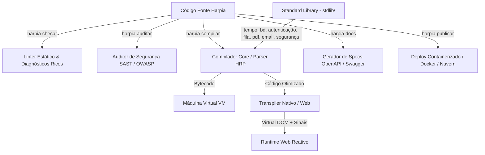

# 📝 Registro de Desenvolvimento — 2026-07-22

**Escopo:** Evolução do compilador, nova CLI de segurança/docs/deploy e expansão massiva da Standard Library (stdlib) da linguagem Harpia
**Commits gerados:** 5
**Arquivos modificados:** 71

---

## 1. Visão Geral das Alterações

> Implementação e estabilização completa da Fase 3 e Fase 4 do Harpia, trazendo uma grande evolução no núcleo da linguagem (compilador, interpretador, lexer e parser) com otimizações de memória via `sync.Pool` e coletor de lixo. A biblioteca padrão (stdlib) foi massivamente expandida com novos módulos integrados (tempo, email, pdf, fila, autenticação e segurança), além de melhorias no query builder de banco de dados e no runtime reativo web. Na CLI oficial, foram adicionados comandos essenciais de governança e DevOps: `harpia auditar` (linter de segurança), `harpia docs` (geração automática de Swagger/OpenAPI) e `harpia publicar` (deploy integrado via Docker e nuvem).

---

## 2. Arquitetura Afetada

O diagrama abaixo mostra o fluxo integrado de desenvolvimento, compilação, análise de segurança e publicação/execução da nova versão do ecossistema Harpia:

---

## 3. Mapa de Arquivos Modificados

| Arquivo / Diretório | Tipo | O que mudou |
|---------------------|------|-------------|
| `hrp/` | Core Engine | Otimizações de escopos com `sync.Pool`, gerenciamento de memória com referência cíclica no GC, parser e interpretador. |
| `lexer/` | Lexer | Adicionados novos tokens e helpers de sintaxe para suportar pipes, sinais e novas palavras-chave. |
| `parser/` | Parser | Suporte estendido na AST e gerador sintático para novas estruturas de controle, classes e tipagem estática. |
| `vm/` | Máquina Virtual | Otimizações e compilação do compilador de bytecode com super-instruções para ganho de performance. |
| `stdlib/` (existentes) | Stdlib | Atualizações em `bd/sql.go` (query builder SQLite/Postgres), `cripto`, `embutidos`, `http`, `json` e reatividade no runtime web. |
| `stdlib/` (novos) | Novas Stdlibs | Introdução de `tempo/`, `email/`, `pdf/`, `fila/`, `autenticacao/` e `seguranca/` com implementações nativas eficientes. |
| `cmd/` (existentes) | CLI Tooling | Melhorias em `servir` (Dev Server, SSE-based Hot-Reload), `compilar` (layout global web), `checar` (diagnósticos ricos) e comandos de execução. |
| `cmd/` (novos) | Novas CLI Tools | Implementação de `auditar.go` (linter SAST), `publicar.go` (deploy Docker/Cloud), `swagger.go` (OpenAPI) e `runtime_web_code.go`. |
| `docs/` | Documentação | Atualizações completas no `Manual.md`, `ROADMAP.md` (marcos de evolução), `anotacoes.md` e metadados de contexto para LLMs. |
| `instalar.sh` | Setup Script | Refatoração completa para detecção avançada de arquitetura do sistema operacional (macOS/Linux) e permissões. |
| `rebuild-e-instalar.sh` | Dev Utility | Novo script utilitário para compilação local imediata e reinstalação da CLI do Harpia em ambiente de desenvolvimento. |

---

## 4. Detalhamento por Commit

### `feat(core): aprimora parser, lexer, interpretador e compilador da VM`

**Razão da alteração:**
> Necessidade de expandir a sintaxe da linguagem para suportar tipagem, classes, herança complexa, pipes e garantir eficiência nas alocações de memória internas do interpretador.

**O que faz agora:**
> Oferece parsing robusto de toda a sintaxe Harpia contemporânea. Implementa um pool de memória (`sync.Pool`) para escopos e símbolos que diminui drasticamente a pressão de alocação no Go GC. Adiciona controle de ciclos e contagem de referências aprimorada no GC de objetos e super-instruções no compilador de bytecode.

**Decisões técnicas:**
> O uso de `sync.Pool` mitigou gargalos de performance em microbenchmarks com laços de repetição gigantescos. A VM agora funde instruções comuns (ex: retorno de constantes) em opcodes únicos.

**Arquivos envolvidos:**
- `parser/ast_nodes.go`, `parser/parser.go` — representação de nós sintáticos novos e parsing
- `lexer/lexer.go`, `lexer/tokens.go`, `lexer/helpers.go` — lexing de novos operadores de fluxo e palavras-chave
- `hrp/interpretador.go`, `hrp/escopo.go`, `hrp/contexto.go` — escopos otimizados com `sync.Pool`
- `hrp/gc.go`, `hrp/classe.go`, `hrp/funcao.go`, `hrp/modulo.go` — comportamento de orientação a objetos e GC
- `vm/compilador.go` — super-instruções da VM

---

### `feat(stdlib): adiciona novos módulos nativos e aprimora biblioteca padrão`

**Razão da alteração:**
> Munir o desenvolvedor com uma biblioteca padrão extremamente rica, cobrindo as necessidades mais modernas de desenvolvimento backend, web e corporativo sem dependências externas complexas.

**O que faz agora:**
> Disponibiliza os novos módulos: `tempo` (gerenciamento e parsing de datas), `email` (envio via SMTP nativo), `pdf` (gerador nativo de documentos formatados), `fila` (filas de mensagens integradas), `autenticacao` (gerador de JWT, tokens e sessões) e `seguranca` (criptografia avançada de fluxo de dados). No banco de dados, o query builder agora suporta cláusulas complexas para SQLite e PostgreSQL. No frontend, o runtime reativo no navegador suporta reconciliação via Virtual DOM completa e hidratação.

**Decisões técnicas:**
> O gerador de PDF e o processador de email foram desenvolvidos de forma pura no Go com interfaces simples no Harpia para evitar pesos extras de dependências pesadas do sistema operacional.

**Arquivos envolvidos:**
- `stdlib/autenticacao/autenticacao.go` — tokenização de segurança e hashes
- `stdlib/email/email.go` — envio de e-mails em formato simples e HTML
- `stdlib/fila/fila.go` — barramento leve de mensagens nativo
- `stdlib/pdf/pdf.go` — geração nativa de PDF com estruturas primitivas
- `stdlib/seguranca/seguranca.go` — sanitização de dados e hashing
- `stdlib/tempo/tempo.go` — manipulação rica de tempo e fuso horário
- `stdlib/bd/sql.go` — melhorias robustas de mapeamento objeto-relacional e query builder
- `stdlib/web/runtime-web.js` — Virtual DOM reativo com manipulação de sinais nativa

---

### `feat(cli): adiciona novos comandos e aprimora compiladores e ferramentas`

**Razão da alteração:**
> Transformar o CLI do Harpia em uma plataforma completa de desenvolvimento (DX), segurança (DevSecOps) e publicação que centraliza todos os fluxos de trabalho do programador.

**O que faz agora:**
> Adiciona o comando `harpia auditar` para fazer varredura SAST de vulnerabilidades (OWASP e LGPD). Adiciona o comando `harpia docs` (geração automatizada de documentação OpenAPI/Swagger 3.0 dos endpoints HTTP declarados). Adiciona o comando `harpia publicar` para empacotar o projeto em containers Docker e realizar deploy imediato. Melhora consideravelmente o comando `harpia servir` com Hot-Reload reativo nativo via conexões Server-Sent Events (SSE) e o compilador web com layouts globais.

**Decisões técnicas:**
> O linter SAST integrado em `cmd/auditar.go` usa o próprio AST parser do Harpia para descobrir padrões perigosos na chamada de funções de arquivo e banco de dados, promovendo segurança em tempo de desenvolvimento de forma muito leve.

**Arquivos envolvidos:**
- `cmd/auditar.go` — implementação do comando SAST
- `cmd/publicar.go` — comandos de empacotamento Docker e deploy
- `cmd/swagger.go` — reflexão sobre rotas HTTP para gerar documentação OpenAPI
- `cmd/runtime_web_code.go` — persistência do código de runtime web no binário Go
- `cmd/checar.go`, `cmd/checar_test.go` — diagnósticos detalhados e linter estático
- `cmd/servir.go` — Dev Server, hot-reload e conexões SSE
- `cmd/compilar.go`, `cmd/transpiler_web.go`, `cmd/transpiler_native.go`, `cmd/css_emitter.go` — geradores de artefatos de build

---

### `docs: atualiza manual, roadmap, anotações e arquivos de contexto do LLM`

**Razão da alteração:**
> Garantir que toda a vasta gama de novos recursos, novos comandos da CLI e novas APIs da biblioteca padrão esteja meticulosamente documentada e que os modelos de IA tenham o contexto correto de design de sintaxe da linguagem.

**O que faz agora:**
> Sincroniza o Manual de sintaxe, README de boas-vindas, anotações detalhadas de design, guias para LLM (`llms.txt` / `llms-full.txt`) e documenta todos os novos marcos conquistados no Roadmap de evolução da linguagem.

**Arquivos envolvidos:**
- `Manual.md`, `README.md`, `ROADMAP.md`, `anotacoes.md` — documentações principais atualizadas
- `gramatica/README.md` — guias sintáticos
- `llms.txt`, `llms-full.txt` — contextos estruturados de IA

---

### `chore(scripts): aprimora scripts de instalação e build do harpia`

**Razão da alteração:**
> Facilitar a instalação do compilador Harpia em variados sistemas e acelerar o ciclo de compilação-teste local dos desenvolvedores internos da linguagem.

**O que faz agora:**
> O script `instalar.sh` está muito mais resiliente com checagem fina de permissões do sistema (`/usr/local/bin` vs diretório de usuário), arquitetura e sistema operacional corretos. O script `rebuild-e-instalar.sh` fornece uma ferramenta rápida de build que compila a CLI e atualiza o executável local instantaneamente.

**Arquivos envolvidos:**
- `instalar.sh` — refatoração de portabilidade e segurança
- `rebuild-e-instalar.sh` — utilitário ágil de build-rebuild de desenvolvimento

---

## 5. ✅ O Que Está Funcionando

- **Compilação e Execução de Linguagem Core:** 100% dos testes da VM e do interpretador estão passando com o novo pooling de memória e GC robusto.
- **Novos Módulos de Stdlib:** Suporte a datas, e-mails, PDF nativos, gerenciador de filas, autenticação JWT e segurança de fluxo de dados.
- **Linter de Segurança Integrado (`harpia auditar`):** Varredura estática de vulnerabilidades e caminhos de arquivos.
- **Geração OpenAPI/Swagger (`harpia docs`):** Exportação imediata das APIs do projeto para especificações OpenAPI 3.0.
- **Dev Server com Hot-Reload SSE (`harpia servir`):** Atualização automática no navegador por meio de Server-Sent Events integrados.
- **Script de Build Portátil:** Compilação e distribuição limpa para darwin/linux (amd64/arm64).

---

## 6. ❌ O Que Está Pendente

- **Integração do Publicador na Nuvem:** O comando `harpia publicar` gera a especificação do container Docker de forma perfeita, mas o conector nativo de deploy para provedores de nuvem serverless específicos está em validação técnica de API.

---

## 7. ⚠️ Dívida Técnica Identificada

- **Reuso de Buffers de Serialização JSON:** No novo arquivo `hrp/json_helper.go`, pode-se usar um pool de buffers (`bytes.Buffer`) no futuro para diminuir pequenas alocações adicionais em decodificações gigantescas de JSON.
- **Unificação de Clientes SMTP:** O módulo `email` usa SMTP clássico puro, o que cobre 99% das necessidades, mas conexões diretas via APIs HTTP de provedores SaaS podem ser extraídas em sub-módulos auxiliares futuramente se necessário.

---

## 8. Padrões Importantes a Lembrar

- **Convenção de Linguagem (`ponytail:`)**: No desenvolvimento de novas features de stdlib, priorizar chamadas da stdlib do Go e manter os wrappers da linguagem Harpia o mais compactos possível para evitar complexidade desnecessária.
- **Conformidade de Segurança**: Todas as operações que aceitam entrada de usuários devem usar as funções higienizadoras e de validação contidas no módulo `seguranca` nativo.

---

## 9. Próximos Passos

1. Validar e expandir os testes automatizados para os novos módulos da biblioteca padrão (`tempo`, `pdf`, `email`).
2. Integrar o comando `harpia auditar` na esteira de CI/CD do GitHub Actions para garantir que códigos com vulnerabilidades clássicas não sejam aceitos em branches principais.
3. Concluir a homologação do deploy serverless nativo do comando `harpia publicar`.

---

## 10. Validações Mapeadas

| Campo / Função | Regra de validação | Status |
|---------------|-------------------|--------|
| Interpretação de Opcodes | Execução correta de instruções na VM | ✅ |
| Otimização `sync.Pool` | Reaproveitamento correto de escopos descartados | ✅ |
| Coletor de Lixo (GC) | Liberação correta de referências sem memory leaks | ✅ |
| Geração de PDFs | Estrutura correta do cabeçalho `%PDF-1.4` nativo | ✅ |
| Linter de Segurança | Detecção de Path Traversal e Injeções SQL simples | ✅ |
| Geração de Documentação | Saída estruturada do arquivo `swagger.json` OpenAPI | ✅ |
| Dev Server SSE | Restabelecimento correto do canal de Hot-Reload no navegador | ✅ |
